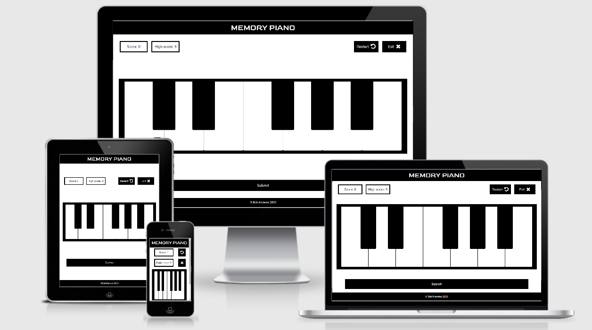

# Memory Piano

A memory game in the style of Simon/Bop It where the player has to remember what notes were played on a piano and play them back. It will get harder as more and more notes have to be remembered.

Created for my Code Institute Interactive Frontend Development milestone project.

A link to the live site can be found [here](https://robknowles248.github.io/memory-game/).

 
## UX

### Primary Goals

To create a memory game that is fun for the user and simple to learn, while getting continually more challenging.

### Developer Goals

- To gain experience using JavaScript and JQuery to create interactive user friendly websites.
- To create a game I will enjoy playing.

### User Stories

As a player of the game I want:

1. Clear and simple instructions on the rules of the game so I am not confused about how to play.
2. An intuitive UI so I can easily play the game.
3. Continually increasing difficulty so I do not get bored with the game quickly.
4. A rolling high score to track my progress and give me something to aim for.

### Wireframes

- [Main page](assets/wireframes/memory-piano.pdf)

## Features

In this section, you should go over the different parts of your project, and describe each in a sentence or so.

- Piano feature on screen which will play notes and you can play back to.
- Rolling score and high scores on screen.
- "Restart game" button to restart the game at any point.
- "Submit" button to see if your sequence of notes was correct.
- "Game Over" modal that pops up when you get a sequence wrong and forces you to restart the game.

### Features Left to Implement
- Another feature idea

## Technologies Used

- [HTML5](https://en.wikipedia.org/wiki/HTML#:~:text=Hypertext%20Markup%20Language%20(HTML)%20is,scripting%20languages%20such%20as%20JavaScript.)
- [CSS3](https://en.wikipedia.org/wiki/CSS)
- [Bootstrap4](https://getbootstrap.com/)
- [JavaScript](https://en.wikipedia.org/wiki/JavaScript)
- [JQuery](https://jquery.com)

## Testing

In this section, you need to convince the assessor that you have conducted enough testing to legitimately believe that the site works well. Essentially, in this part you will want to go over all of your user stories from the UX section and ensure that they all work as intended, with the project providing an easy and straightforward way for the users to achieve their goals.

Whenever it is feasible, prefer to automate your tests, and if you've done so, provide a brief explanation of your approach, link to the test file(s) and explain how to run them.

For any scenarios that have not been automated, test the user stories manually and provide as much detail as is relevant. A particularly useful form for describing your testing process is via scenarios, such as:

- I tested the responsivity of the site using Chrome developer tools and [http://ami.responsivedesign.is/](http://ami.responsivedesign.is/).

### Bugs discovered

1. Game was easy to break as you could click each key directly after it was played
    - I solved this by adding a boolean variable `pianoLocked` that when `true`, stopped all the functionality in the notes click event.
     
    - I then added functionality to the `playNotes` function so that `pianoLocked` was `true` while it was playing notes.
    

## Deployment

This page was deployed on GitHub pages using the master branch and will automatically update upon any new commits to the master branch.

In order to replicate the process on your own computer you can paste `git clone https://github.com/RobKnowles248/memory-game.git` into the command panel of any code editor and use `git remote rm origin` to cut ties with the original GitHub repository. You can then push this code to GitHub using `git push` making sure that the home page is called `index.html`. To deploy onto GitHub pages you go onto the setting tab of the repository and scroll down to "GitHub Pages". You then choose your source as the master branch and click "save". A link to the deployed website should now appear.

## Credits

### Media

- The audio for the piano keys was obtained from this [Reddit post](https://www.reddit.com/r/piano/comments/3u6ke7/heres_some_midi_and_mp3_files_for_individual/).

### Acknowledgements

- I received inspiration for this project from the memory game [Simon](https://en.wikipedia.org/wiki/Simon_(game)).